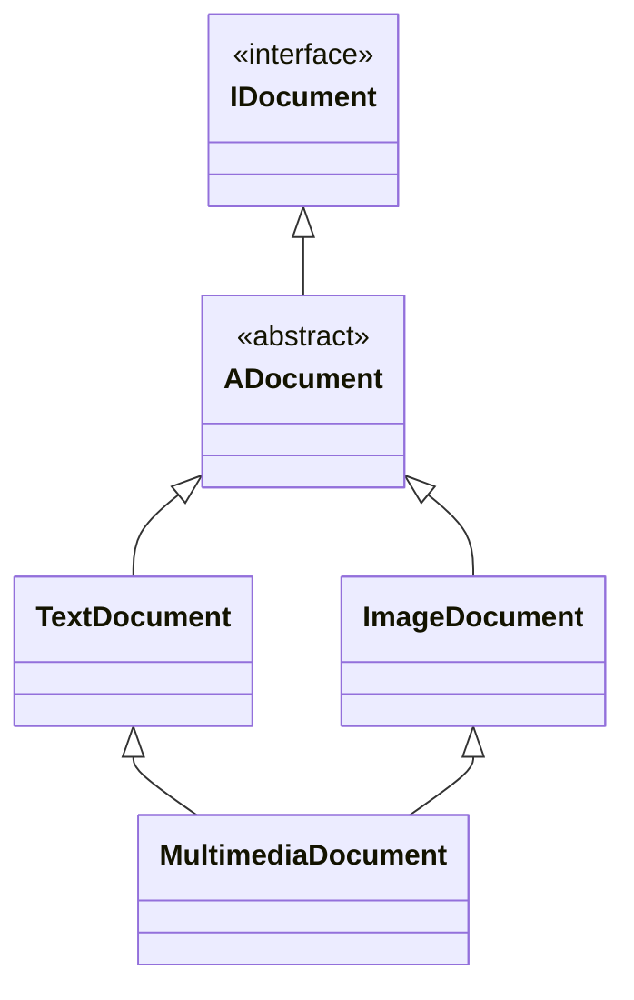

# Fondamentaux de la programmation orientée objet (POO)

**La programmation orientée objet** est une façon de programmer qui consiste à organiser le code autour d’objets plutôt que de simples fonctions. Un objet, c’est une sorte de *“chose”* qui représente un élément du monde réel comme un *document, un étudiant ou un compte bancaire.*

## 1.1. Les classes et objets

> **Un objet** est une structure de données qui regroupe des **valeurs nommées appelées attributs** et des **fonctions appelées méthodes.**

> **Une classe** est un modèle ou un plan qui décrit **les caractéristiques (attributs) et les comportements (méthodes)** que posséderont les objets créés à partir d’elle.

Pour créer une classe, on définit d’abord sa déclaration dans un fichier d’en-tête `.hpp`. Cette déclaration décrit la structure de la classe : ses attributs, ses méthodes et ses constructeurs. Le fichier `.hpp` ne contient que cette description, sans implémentation :

```cpp title="Document.hpp"
#ifndef DOCUMENT_HPP
#define DOCUMENT_HPP

// Une énumération définit un type contenant un ensemble fixe de valeurs possibles.
enum class ThemeColor {
    Black,
    White,
    Gray,
    Silver,
    Red,
    DarkRed,
    Crimson,
    Pink,
    HotPink,
    Blue,
    DarkBlue,
    Navy,
    SkyBlue,
    Cyan,
    Turquoise,
    Green,
    DarkGreen,
    Lime,
    Olive,
    Teal,
    Yellow,
    Gold,
    Orange,
    DarkOrange,
    Purple,
    Indigo,
    Violet,
    Magenta,
    Brown,
    SaddleBrown,
    Chocolate,
    Beige,
    Ivory,
    Coral
};

class Document {
public:
    /** 
     * Le constructeur `Document` est une fonction spéciale appelée lors de la
     * création d’un objet `Document`. Il sert à initialiser l’objet avec la
     * couleur passée en paramètre.
     *
     * NOTE : Si une classe ne possède aucun attribut à initialiser,
     * on peut utiliser un constructeur par défaut :
     * `Document() = default;`
     */
    Document(ThemeColor themeColor);

    /** 
     * Le destructeur est appelé quand l’objet disparaît, pour libérer les ressources
     * qu’il utilisait. Ici, il est défini par défaut car la classe ne gère aucune
     * ressource dynamique (mémoire allouée manuellement, fichiers, connexions, etc.).
     */
    ~Document() = default;

    // Un setter permet de modifier une valeur
    void updateThemeColor(ThemeColor themeColor);

    // Un getter permet de lire une valeur
    ThemeColor getThemeColor() const;
private:
    // L’attribut `_themeColor` stocke la couleur associée au document
    ThemeColor _themeColor;
};

#endif
```

:::info
_Les mot-clés `public` et `private` sont des modificateurs d’accès utilisés pour les attributs, les constructeurs et les méthodes. Il existe différents types de modificateurs d’accès, qui seront présentés progressivement._

> Les membres déclarés `public` sont accessibles depuis n’importe quel autre fichier, à condition que la déclaration de la classe soit visible via un `#include`.
> 
> Les membres déclarés `private` sont accessibles uniquement à l’intérieur de la classe dans laquelle ils sont définis.
:::

Le comportement réel des méthodes (et l’initialisation des attributs) est ensuite implémenté dans un fichier source `.cpp` :

```cpp title="Document.cpp"
#include "Document.hpp"

Document::Document(const ThemeColor themeColor) : _themeColor(themeColor) {}

void Document::updateThemeColor(const ThemeColor themeColor) {
    _themeColor = themeColor;
}

ThemeColor Document::getThemeColor() const {
    return _themeColor;
}
```

Une fois la classe définie, il est possible de créer une instance de la classe `Document` :

```cpp title="main.cpp"
#include <iostream>

#include "Document.hpp"

int main() {
    // Créer un nouvel objet `document`, c'est-à-dire une instance de `Document`.
    Document const document(ThemeColor::Red);

    if (document.getThemeColor() == ThemeColor::Red)
        std::cout << "Le thème du document est rouge !" << std::endl;
}
```

`document` est une variable qui représente directement un objet, autrement dit une **instance** de la classe `Document`. Lorsque l’on parle d’instance, on fait référence à l’objet complet en mémoire, c’est-à-dire à une structure qui regroupe des attributs et des méthodes :

> **Une instance** désigne le fait que cet objet a été créé à partir d'un modèle (une classe).

## 1.2. L’encapsulation

> **L’encapsulation** consiste à regrouper les données et les méthodes qui les manipulent au sein d’une même classe, tout en masquant l’état interne derrière une interface publique contrôlée.

Dans la classe `Document` ci-dessus, l’attribut `_themeColor` est `private` : il est inaccessible depuis l’extérieur. Le seul moyen de le lire ou de le modifier passe par `getThemeColor()` et `updateThemeColor(...)`.

Ce n’est pas une formalité. Un document peut également posséder une taille de police. Cette taille doit évidemment rester strictement positive : c’est ce qu’on appelle un **invariant** de la classe. Déclarée `public`, elle peut être modifiée par n’importe quel code, sans aucun contrôle :

```cpp
// Sans encapsulation : l’état de l’objet est à la merci de l’extérieur
class Document {
public:
    Document() = default;
    ~Document() = default;

    int fontSize;
};

Document document;
document.fontSize = -12; // Taille de police négative : rien ne l’empêche
```

L’objet se retrouve dans un état incohérent, et la classe n’a aucun moyen de s’en apercevoir. En passant par une méthode, elle garde la main sur ce qui est autorisé et peut réagir à ses propres changements d’état :

```cpp title="Document.hpp"
class Document {
public:
    Document(ThemeColor themeColor, int fontSize);
    ~Document() = default;

    void updateFontSize(int fontSize);
    int getFontSize() const;
private:
    void refreshLayout();

    ThemeColor _themeColor;
    int        _fontSize;
};
```

```cpp title="Document.cpp"
void Document::updateFontSize(const int fontSize) {
    if (fontSize <= 0)
        return; // La classe refuse d’entrer dans un état invalide

    _fontSize = fontSize;
    refreshLayout(); // Elle peut aussi réagir à son propre changement d’état
}

int Document::getFontSize() const { return _fontSize; }
```

L’encapsulation apporte trois garanties :

- **Les invariants sont préservés** : la classe contrôle chaque modification, donc son état reste toujours valide.
- **L’implémentation reste libre** : tant que l’interface publique ne change pas, la représentation interne peut évoluer sans impacter le code appelant.
- **La surface d’erreur diminue** : moins de code a accès à l’état, moins il existe d’endroits où le corrompre.

:::info
Récapitulatif des trois modificateurs d’accès du C++ :

| Modificateur | Accessible depuis                                                           |
|--------------|-----------------------------------------------------------------------------|
| `public`     | N’importe où, à condition que la déclaration soit visible via un `#include` |
| `protected`  | La classe elle-même et ses sous-classes                                     |
| `private`    | La classe elle-même uniquement                                              |

Par défaut, les membres d’une `class` sont `private`, tandis que ceux d’une `struct` sont `public`.
:::

## 1.3. Le polymorphisme : héritage, overriding et overloading

> **Le polymorphisme** est le concept global qui dit qu’un même nom peut recouvrir plusieurs comportements différents selon le contexte.

Il en existe deux formes :

- Le **polymorphisme à la compilation**, où le compilateur choisit la version à appeler d’après les types des arguments. C’est l’**overloading** (section 1.3.3).
- Le **polymorphisme à l’exécution**, où le choix se fait selon le type réel de l’objet. C’est l’**overriding** combiné aux fonctions `virtual` (section 1.3.2).

Si cela paraît flou, c’est normal : le concept sera abordé progressivement, étape par étape, à l’aide d’un exemple concret, puis d’explications détaillées :

```cpp title="Document.hpp"
#ifndef DOCUMENT_HPP
#define DOCUMENT_HPP

enum class ThemeColor {...};

class Document {
public:
    Document(ThemeColor themeColor);
    // Évite les problèmes de ressources non libérées, les fuites mémoire et les comportements indéfinis
    virtual ~Document() = default;

    void updateThemeColor(ThemeColor themeColor);
    ThemeColor getThemeColor() const;

    // `virtual` permet de choisir la méthode à appeler au moment de l’exécution
    virtual void showDocumentType() const = 0;
protected:
    ThemeColor _themeColor;
};

#endif
```

:::info
`protected` : Les membres déclarés `protected` sont accessibles à l’intérieur de la classe où ils sont définis ainsi que dans ses sous-classes. En revanche, ils ne sont pas accessibles depuis l’extérieur de cette hiérarchie de classes.
:::

```cpp title="Document.cpp"
#include "Document.hpp"

Document::Document(const ThemeColor themeColor) : _themeColor(themeColor) {}

void Document::updateThemeColor(const ThemeColor themeColor) {
    _themeColor = themeColor;
}

ThemeColor Document::getThemeColor() const {
    return _themeColor;
}
```

```cpp title="TextDocument.hpp"
#ifndef TEXT_DOCUMENT_HPP
#define TEXT_DOCUMENT_HPP

#include "Document.hpp"

// Déclaration de la classe `TextDocument` héritant publiquement de `Document`
class TextDocument : public Document {
public:
    TextDocument(ThemeColor themeColor);
    ~TextDocument() override = default;

    void showDocumentType() const override;
};

#endif
```

```cpp title="TextDocument.cpp"
#include <iostream>

#include "TextDocument.hpp"

TextDocument::TextDocument(const ThemeColor themeColor) : Document(themeColor) {}

void TextDocument::showDocumentType() const {
    std::cout << "Ce document contient uniquement du texte." << std::endl;
}
```

```cpp title="ImageDocument.hpp"
#ifndef IMAGE_DOCUMENT_HPP
#define IMAGE_DOCUMENT_HPP

#include "Document.hpp"

// Déclaration de la classe `ImageDocument` héritant publiquement de `Document`
class ImageDocument : public Document {
public:
    ImageDocument(ThemeColor themeColor);
    ~ImageDocument() override = default;

    void showDocumentType() const override;
};

#endif
```

```cpp title="ImageDocument.cpp"
#include <iostream>

#include "ImageDocument.hpp"

ImageDocument::ImageDocument(const ThemeColor themeColor) : Document(themeColor) {}

void ImageDocument::showDocumentType() const {
    std::cout << "Ce document contient uniquement une image." << std::endl;
}
```

```cpp title="main.cpp"
#include "TextDocument.hpp"
#include "ImageDocument.hpp"

int main() {
    // Créer un nouvel objet `textDocument`, c'est-à-dire une instance de `TextDocument` qui hérite de `Document`.
    const TextDocument textDocument(ThemeColor::Red);
    textDocument.showDocumentType();

    // Créer un nouvel objet `imageDocument`, c'est-à-dire une instance de `ImageDocument` qui hérite de `Document`.
    const ImageDocument imageDocument(ThemeColor::White);
    imageDocument.showDocumentType();
}
```

### 1.3.1. L'héritage

Dans un premier temps, il convient de définir l’héritage et de comprendre son fonctionnement.

> **L’héritage** permet à une sous-classe de réutiliser les attributs et les méthodes d’une super-classe.

```cpp
class TextDocument : public Document {...};

class ImageDocument : public Document {...};
```

Le mot-clé `public Document` signifie _"hérite de"_. Ainsi, les classes `TextDocument` et `ImageDocument` héritent des attributs et des méthodes de la super-classe `Document`. Elles deviennent donc des sous-classes de `Document`.

:::warning
Point très important à comprendre concernant l’héritage : il arrive que certaines méthodes soient redéfinies (overriding) dans une sous-classe. Toutefois, une sous-classe peut également choisir de ne pas redéfinir une méthode et d’utiliser directement celle héritée de la classe parente.

Afin de bien comprendre ces mécanismes, il est nécessaire de distinguer la surcharge (overloading) de la redéfinition (overriding). La redéfinition est traitée juste en dessous, la surcharge à la section 1.3.3.
:::

### 1.3.2. L'overriding : la redéfinition

> **L’overriding** est un mécanisme qui permet à une sous-classe de fournir sa propre implémentation d’une méthode déjà définie dans la classe parente. La méthode redéfinie doit avoir **le même nom, les mêmes paramètres et le même type de retour** que celle du parent.

La classe `Document` définit :

```cpp title="Document.hpp"
virtual void showDocumentType() const = 0;
```

Dans les sous-classes `TextDocument` et `ImageDocument`, la même méthode est redéfinie :

```cpp title="TextDocument.hpp, ImageDocument.hpp"
void showDocumentType() const override;
```

```cpp title="TextDocument.cpp, ImageDocument.cpp"
void TextDocument::showDocumentType() const {
    std::cout << "Ce document contient uniquement du texte." << std::endl;
}

void ImageDocument::showDocumentType() const {
    std::cout << "Ce document contient uniquement une image." << std::endl;
}
```


#### 1.3.2.1. Le mot clé `virtual`

Pour comprendre le mot-clé `virtual`, il faut d’abord comprendre une problématique liée à l’héritage en programmation orientée objet. Lorsque deux objets différents partagent une même classe parente et appellent la même méthode, le compilateur ne sait pas toujours quelle version de la méthode utiliser.

```cpp
const Document *textDocument = new TextDocument(ThemeColor::Red);
textDocument->showDocumentType();

const Document *imageDocument = new ImageDocument(ThemeColor::White);
imageDocument->showDocumentType();
```

Dans ce cas, les objets sont vus comme des `Document`, même s’ils sont en réalité une `TextDocument` et une `ImageDocument`. Sans mécanisme particulier, c’est la méthode de la classe `Document` qui serait appelée. C’est ici qu’intervient le mot-clé `virtual`, qui permet **la liaison dynamique.**

> **La liaison dynamique** est un mécanisme qui détermine quelle méthode redéfinie (overriding) doit être exécutée au moment de l’exécution, selon le type réel de l’objet.

### 1.3.3. L’overloading : la surcharge

> **L’overloading** (surcharge) permet de définir plusieurs fonctions portant **le même nom** dans **la même portée**, à condition qu’elles diffèrent par leurs paramètres (par le nombre ou par les types). Le compilateur choisit la version à appeler d’après les arguments fournis.

Contrairement à l’overriding, la surcharge ne nécessite aucun héritage : tout se passe à l’intérieur d’une seule classe.

```cpp title="Document.hpp"
class Document {
public:
    Document(ThemeColor themeColor);
    virtual ~Document() = default;

    // Trois surcharges de la même méthode
    void updateThemeColor(ThemeColor themeColor);
    void updateThemeColor(const std::string &themeColorName);
    void updateThemeColor(int red, int green, int blue);
protected:
    ThemeColor _themeColor;
};
```

```cpp title="main.cpp"
document.updateThemeColor(ThemeColor::Red); // Appelle la 1re surcharge
document.updateThemeColor("Red");           // Appelle la 2e surcharge
document.updateThemeColor(255, 0, 0);       // Appelle la 3e surcharge
```

Le choix est fait **à la compilation** : le compilateur regarde les types des arguments et sélectionne la fonction correspondante. C’est ce qu’on appelle la **liaison statique**, par opposition à la liaison dynamique de la section 1.3.2.1.

:::warning
Le type de retour ne participe **pas** au choix de la surcharge. Deux méthodes qui ne diffèrent que par leur type de retour provoquent une erreur de compilation :

```cpp
void       updateThemeColor(ThemeColor themeColor);
ThemeColor updateThemeColor(ThemeColor themeColor); // Erreur : redéclaration de la même fonction
```
:::

Le tableau suivant résume la distinction annoncée à la section 1.3.1 :

| | Overloading (surcharge) | Overriding (redéfinition) |
| --- | --- | --- |
| Portée | Une même classe | De la classe parente vers la sous-classe |
| Signature | Doit **différer** | Doit être **identique** |
| Héritage nécessaire | Non | Oui |
| `virtual` nécessaire | Non | Oui, pour la liaison dynamique |
| Résolution | À la compilation (liaison statique) | À l’exécution (liaison dynamique) |

## 1.4. Interfaces et classes abstraites

> **Une interface** définit un contrat de comportement qu’une classe doit respecter, sans fournir d’implémentation ni contenir d’état.

> **Une classe abstraite** est une classe qu’on ne peut pas instancier, parce qu’elle contient au moins une méthode virtuelle pure (classe abstraite = classe de base incomplète).

:::warning
Ne pas confondre **méthode virtuelle** et **méthode virtuelle pure** : ce n’est pas la même chose. Une méthode virtuelle peut avoir une implémentation dans une classe, tandis qu’une méthode virtuelle pure (déclarée avec = 0) est uniquement déclarée et doit être implémentée dans les sous-classes.

> Méthode virtuelle pure : `virtual void func() = 0;`
> 
> Méthode virtuelle : `virtual void func();`

Il faut noter qu’une classe abstraite peut contenir des méthodes virtuelles, alors qu’une interface ne doit pas en contenir.
:::

```cpp title="IDocument.hpp"
#ifndef IDOCUMENT_HPP
#define IDOCUMENT_HPP

enum class ThemeColor {...};

class IDocument {
public:
    virtual ~IDocument() = default;
    virtual void updateThemeColor(ThemeColor themeColor) = 0;
    virtual ThemeColor getThemeColor() const = 0;
    virtual void showDocumentType() const = 0;
};

#endif
```

Pour créer une interface, on déclare uniquement des méthodes virtuelles pures (à implémenter plus tard dans des sous-classes), ainsi qu’un destructeur virtuel défini par défaut, indispensable pour permettre une destruction correcte via un pointeur de base.

```cpp title="ADocument.hpp"
#ifndef ADOCUMENT_HPP
#define ADOCUMENT_HPP

#include "IDocument.hpp"

class ADocument : public IDocument {
public:
    ADocument(ThemeColor themeColor);
    ~ADocument() override = default;

    void updateThemeColor(ThemeColor themeColor) override;
    ThemeColor getThemeColor() const override;
protected:
    ThemeColor _themeColor;
};

#endif
```

Dans l'exemple ci-dessus, on présente la définition d'une classe abstraite `ADocument` qui hérite d'une interface IDocument. Une interface est elle-même une classe abstraite, mais dans sa forme la plus restrictive : elle ne contient ni état ni implémentation. La classe `ADocument` fournit une implémentation partielle, notamment pour la gestion de la couleur, mais laisse certaines méthodes non définies.

La méthode `showDocumentType()` devra être implémentée dans les classes concrètes qui hériteront de `ADocument`.

```cpp title="ADocument.cpp"
#include "ADocument.hpp"

ADocument::ADocument(const ThemeColor themeColor) : _themeColor(themeColor) {}

void ADocument::updateThemeColor(const ThemeColor themeColor) { _themeColor = themeColor; }

ThemeColor ADocument::getThemeColor() const { return _themeColor; }
```

À partir d’ici, les classes `TextDocument` et `ImageDocument` de la section 1.3 n’héritent plus directement de `Document`, mais de `ADocument`. C’est cette hiérarchie qui sera utilisée dans toute la suite de la documentation :

```cpp title="TextDocument.hpp"
#ifndef TEXT_DOCUMENT_HPP
#define TEXT_DOCUMENT_HPP

#include "ADocument.hpp"

class TextDocument : public ADocument {
public:
    TextDocument(ThemeColor themeColor);
    ~TextDocument() override = default;

    void showDocumentType() const override;
};

#endif
```

```cpp title="TextDocument.cpp"
#include <iostream>

#include "TextDocument.hpp"

TextDocument::TextDocument(const ThemeColor themeColor) : ADocument(themeColor) {}

void TextDocument::showDocumentType() const {
    std::cout << "Ce document contient uniquement du texte." << std::endl;
}
```

La classe `ImageDocument` est construite exactement de la même manière, en héritant elle aussi de `ADocument`.

## 1.5. Héritage multiple et ambiguïtés

> **L’héritage multiple** est un mécanisme qui permet à une classe d’hériter de plusieurs classes parentes simultanément. La classe dérivée combine ainsi les attributs et les méthodes de chacune de ses classes de base.

Pour l’illustrer, on repart de la hiérarchie `IDocument` / `ADocument` construite à la section 1.4, et on ajoute une troisième sous-classe qui héritera à la fois de `TextDocument` et de `ImageDocument`. On l’appellera `MultimediaDocument`.

L’héritage multiple peut conduire à une structure appelée **héritage en diamant**, lorsque plusieurs classes parentes partagent une même classe de base :



Il suffit de faire hériter `MultimediaDocument` des deux classes dans sa déclaration :

```cpp title="MultimediaDocument.hpp"
#ifndef MULTIMEDIA_DOCUMENT_HPP
#define MULTIMEDIA_DOCUMENT_HPP

#include "TextDocument.hpp"
#include "ImageDocument.hpp"

class MultimediaDocument : public TextDocument, public ImageDocument {
public:
    MultimediaDocument(ThemeColor themeColor);
    ~MultimediaDocument() override = default;

    void showDocumentType() const override;
};

#endif
```

Le constructeur appelle alors celui de chacune de ses deux classes parentes directes :

```cpp title="MultimediaDocument.cpp"
#include <iostream>

#include "MultimediaDocument.hpp"

MultimediaDocument::MultimediaDocument(const ThemeColor themeColor)
    : TextDocument(themeColor), ImageDocument(themeColor) {}

void MultimediaDocument::showDocumentType() const {
    std::cout << "Ce document combine du texte et des images." << std::endl;
}
```

:::warning
Le problème est que `MultimediaDocument` contient désormais **deux copies distinctes de `ADocument`** : une héritée via `TextDocument`, l’autre via `ImageDocument`. L’objet possède donc deux attributs `_themeColor` indépendants.

```cpp
MultimediaDocument multimediaDocument(ThemeColor::Red);
multimediaDocument.updateThemeColor(ThemeColor::Black); // Erreur de compilation : ambiguïté
```

Le compilateur ne sait pas si l’on souhaite appeler `TextDocument::ADocument::updateThemeColor` ou `ImageDocument::ADocument::updateThemeColor`.
:::

:::success
La solution consiste à partager une seule instance de `ADocument` entre les deux classes, grâce à **l’héritage virtuel** :

```cpp title="TextDocument.hpp, ImageDocument.hpp"
class TextDocument : virtual public ADocument {...};

class ImageDocument : virtual public ADocument {...};
```

`MultimediaDocument` ne contient alors plus qu’un seul sous-objet `ADocument`, et l’appel à `updateThemeColor(...)` devient non ambigu.
:::

:::info
L’héritage virtuel change la règle de construction : c’est **la classe la plus dérivée** qui devient responsable de l’initialisation de la base virtuelle. Le constructeur de `MultimediaDocument` doit donc appeler explicitement celui de `ADocument`, ce qui n’était ni nécessaire ni permis dans la version non virtuelle :

```cpp title="MultimediaDocument.cpp"
MultimediaDocument::MultimediaDocument(const ThemeColor themeColor)
    : ADocument(themeColor), TextDocument(themeColor), ImageDocument(themeColor) {}
```

Les appels à `ADocument(...)` présents dans les constructeurs de `TextDocument` et `ImageDocument` sont alors ignorés lors de la construction d’un `MultimediaDocument`. Ils ne servent que lorsque ces classes sont instanciées seules.
:::
